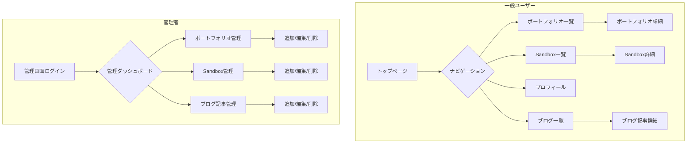

# ユーザーフロー図

```mermaid
graph TD
    subgraph 一般ユーザー
        A[トップページ] --> B{ナビゲーション};
        B --> C[ポートフォリオ一覧];
        C --> D[ポートフォリオ詳細];
        B --> E[Sandbox一覧];
        E --> F[Sandbox詳細];
        B --> G[プロフィール];
        B --> H[ブログ一覧];
        H --> I[ブログ記事詳細];
    end

    subgraph 管理者
        J[管理画面ログイン] --> K{管理ダッシュボード};
        K --> L[ポートフォリオ管理];
        L --> M[追加/編集/削除];
        K --> N[Sandbox管理];
        N --> O[追加/編集/削除];
        K --> P[ブログ記事管理];
        P --> Q[追加/編集/削除];
    end
```
