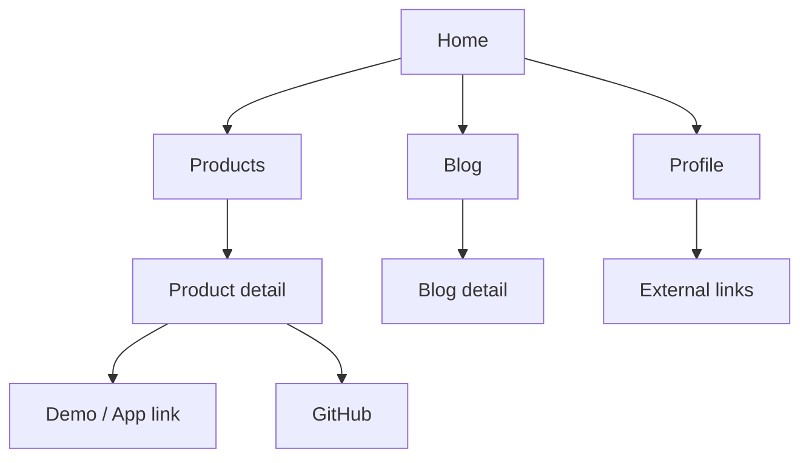
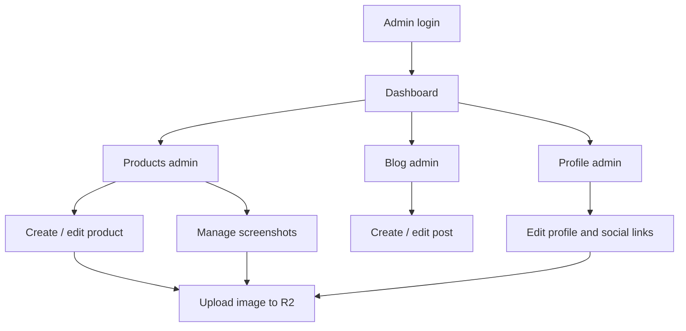

# User Flow

## Visitor

## Admin

## Visibility Rules

- Public pages show only records where `published` is true.
- Admin pages show draft and published records.
- Product links are selected by platform:
  - iOS: `app_store_url`
  - Android: `play_store_url`
  - Web / Other: `demo_url`
